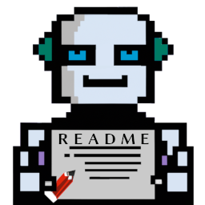

# docuTron

docuTron is a simple program that utilizes OpenAI's API to automatically generate markdown documentation for code. It supports reading files within a directory and understands how files interact with each other in a project. It also allows filtering files by specific extensions and works with any programming language.

## Features

- Automatic markdown documentation generation
- Support for any programming language
- Filter by file extension(s)
- Read files from the current directory or standard input

## Requirements

- Rust 2021 edition
- An OpenAI API key

## Dependencies

- serde_json: 1.0
- reqwest: 0.11 (with json feature)
- dotenv: 0.15.0
- tokio: 1 (with full feature)
- structopt: 0.3
- walkdir: 2.3
- async-recursion: 1.0

## Installation

Build and install using cargo (Rust's package manager):

```sh
cargo build --release
```

The generated binary can be found in `target/release`.

## Usage

To generate documentation for files in the current directory, simply run:

```sh
docuTron -h
```

To filter files by specific extensions, use the `-e` flag followed by a comma-separated list of extensions:

```sh
docuTron -h -e rs,py
```

To specify the OpenAI model to use, pass the `-m` flag along with the desired model:

```sh
docuTron -h -m gpt-8
```

To generate documentation from standard input, run the program without any flags:

```sh
docuTron < input.txt
```

## Author

@tragDate (GitHub, TikTok, YouTube)
Website: https://tragdate.ninja

## License

GPL-3.0
